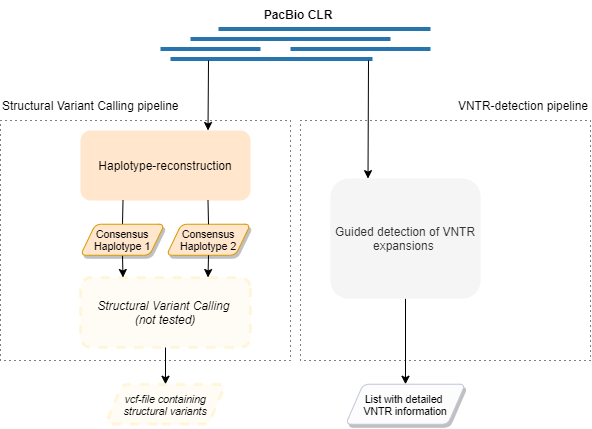

# Long-read pipeline

## Manuals

- [Requirements and installation](docs/INSTALL.md)
- [Usage](docs/USAGE.md)

The Long-read pipeline is a Snakemake pipeline that both reconstructs haplotypes from sequence data of a diploid genome and predict repeat expansions directly on unassembled long reads. The pipeline consists therefore of two parts: the haplotype-reconstruction pipeline and the VNTR-detection pipeline.

  

Above is a general overview of the concerned pipelines. Each pipeline stage shall be explained shortly in the following sections.

## Structural Variant Calling pipeline

### Haplotype-reconstruction stage

  

### Structural Variant Calling stage (not fully complete yet)

  

## VNTR-detection pipeline

  

## Paper

For more details, please see: [Developing and validating bioinformatic pipelines that enable assessment of VNTR expansions across haploid human genomes using noisy long reads](docs/paper.pdf) by N Radunovic.
