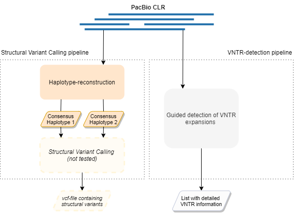

# Usage

  

For reference, a general overview of the pipelines is depicted above.

The pipelines can be called by entering the following line of code in your terminal:

    snakemake -j 100 --latency-wait 180 --cluster-config cluster.json --use-conda --cluster "sbatch -p {cluster.partition} --qos {cluster.qos} --mem={cluster.mem} -t {cluster.time} --ntasks {cluster.ntasks} -c {cluster.cpus-per-task}"

However, before you invoke the pipelines, make sure that you've set the concerned pipelines on 'active', which can be done by uncommenting certain lines in the rule 'all' in the Snakefile.

To change the resources for each step, adjust the cluster.json file as desired.

## Haplotype-reconstruction pipeline

### Output

The output for both approaches can be found in folder downstream_files/assemblies. The files you most probably are interested in are the fasta files, as they contain the consensus haplotypes. Always look at the fasta file that is polished the most times.

## VNTR-detection pipeline

### Output

The output can be found in folder ...
The output looks like this:

    chr22  41914573  41914611  GCGCGA  SHISA8  coding  -2,-2,0,0   -2,-2,0,0,0
    chr22  41994883  41994923  TG      SEPT3   3'UTR   -7,-3,-1,0  -3,-1,0,1

Each line shows one tandem repeat.  The first 3 columns show its
location in [BED3](https://genome.ucsc.edu/FAQ/FAQformat.html#format1)
format, column 4 shows the repeating unit, column 5 shows the gene
name, and column 6 the gene part.  Column 7 shows the copy number
change in each DNA read that covers the repeat's forward strand: for
example -2 means the read has 2 fewer copies than the reference.
Column 8 has the same thing for reverse strands.  Here, the first line
is a nice example with 2 clear alleles, and the second line is a nasty
example without clear alleles.

The output lines are in descending order of "importance", based on
size change and gene part.

## Limitations

* The VNTR-detection pipeline doesn't work for tandem repeats at (or extremely
  near) the edge of a sequence.  This is because `tandem-genotypes` uses DNA reads
  that clearly align beyond both sides of the repeat.
